# Remote Shell Detection — Plaintext Telnet C2 Traffic Analysis

## Summary
Network forensics analysis of a packet capture (`dns-remoteshell.pcap`) containing a Telnet-based reverse shell. Using Wireshark, the investigation traces the attack from initial reconnaissance through lateral movement, identifying the attacker's use of an unencrypted Telnet channel for remote shell access between two internal hosts. The analysis distinguishes confirmed malicious activity from ambiguous traffic that could not be definitively classified without further investigation.

**Tools:** Wireshark
**Protocols observed:** TCP, Telnet, DNS, UDP, TLS

## MITRE ATT&CK Mapping

| Technique ID | Name | Stage |
|---|---|---|
| T1595 | Active Scanning | Reconnaissance |
| T1046 | Network Discovery | Reconnaissance |
| T1071.001 | Application Layer Protocol (Web Protocols) | Command and Control |
| T1083 | File and Directory Discovery | Discovery |
| T1210 | Exploitation of Remote Services (Telnet) | Lateral Movement |

## Attack Narrative

1. **Reconnaissance** — Compromised host `192.168.1.3` (MAC: Intel_78:0c:02) sends a broadcast ARP request to resolve the default gateway (`192.168.1.1`), followed by a DNS reverse-lookup request for network discovery.
2. **Host mapping** — The attacker resolves `192.168.1.2`'s IP-to-MAC mapping and initiates a TCP connection over port 53, followed by probing of ports 53 and 21.
3. **Command and Control** — Traffic shows TLS over port 443 (outbound C2 channel) and plain HTTP over port 80 connecting back to `192.168.1.3`.
4. **Lateral Movement / Remote Shell** — Telnet over port 23 is used to establish a reverse remote shell between `192.168.1.3` and `192.168.1.2`, exploiting the protocol's lack of encryption (T1210).

## Analytical Notes

- Traffic between `192.168.1.2` and an external host (`140.112.253.189`, resolved to National Taiwan University) could not be conclusively classified as either intra-network lateral movement or outbound C2 beaconing based on available evidence. Flagged as requiring further investigation rather than forcing a conclusion.
- Telnet's plaintext nature made command-level visibility possible directly from the capture — a key reason this protocol remains a high-value target for detection engineering despite being largely deprecated in production environments.

## Detection Recommendations

- Alert on any Telnet (port 23) traffic on internal networks — the protocol has no legitimate modern use case in most environments and its presence alone is a strong indicator.
- Monitor for ARP broadcast + DNS reverse-lookup pairs in short succession as a discovery-stage pattern.
- Flag outbound TLS/HTTP sessions immediately following internal reconnaissance activity as potential C2 beaconing for correlation review.

## Evidence

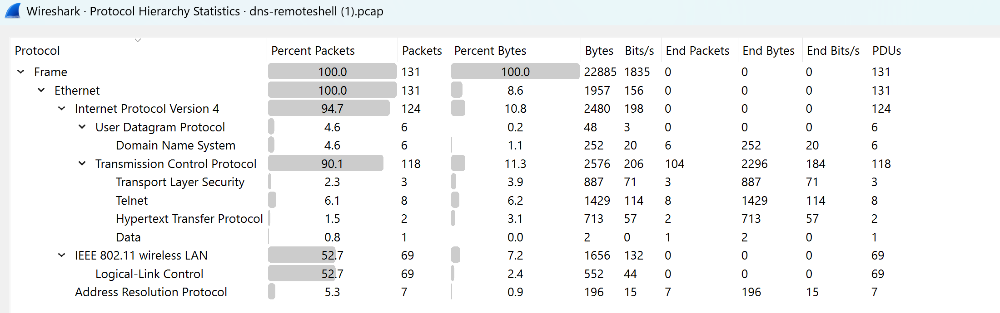
*Protocol hierarchy showing traffic distribution across the capture — primarily two hosts communicating over TCP/Telnet/DNS/HTTP/TLS.*

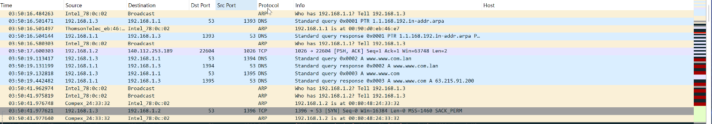
*Attacker (192.168.1.3) sends a broadcast ARP request to resolve the default gateway and a DNS reverse-lookup request as part of initial network discovery.*

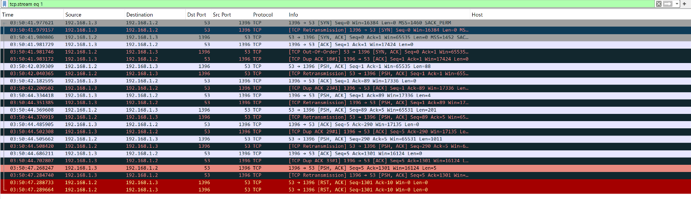
*TCP connection attempt to port 53 (unusual — DNS normally uses UDP). Repeated retransmissions and duplicate ACKs indicate an unstable/probing connection, terminated with RST-ACK.*

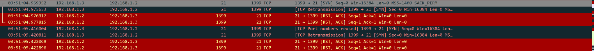
*Failed TCP connection attempt to port 21 (FTP) — a plaintext protocol that would expose credentials if successful.*

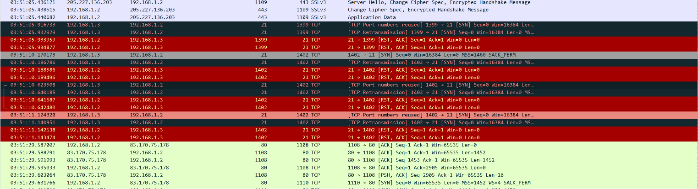
*Potential C2 channel at 205.227.136.203 establishing a TLS connection (port 443) with the victim, alongside failed FTP auth attempts (red) and a stray ACK from an earlier unseen handshake (green).*

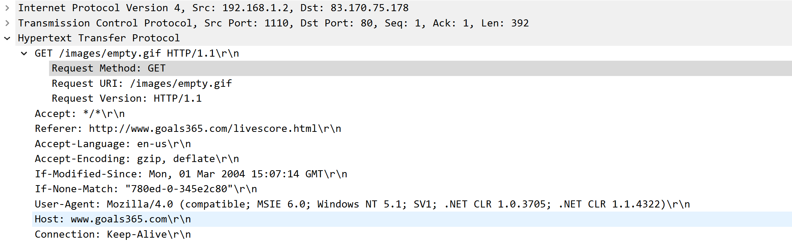
*Victim issues an HTTP GET request to `ww.goals365.com` — a domain deliberately crafted to resemble a sports site and blend in with normal traffic.*

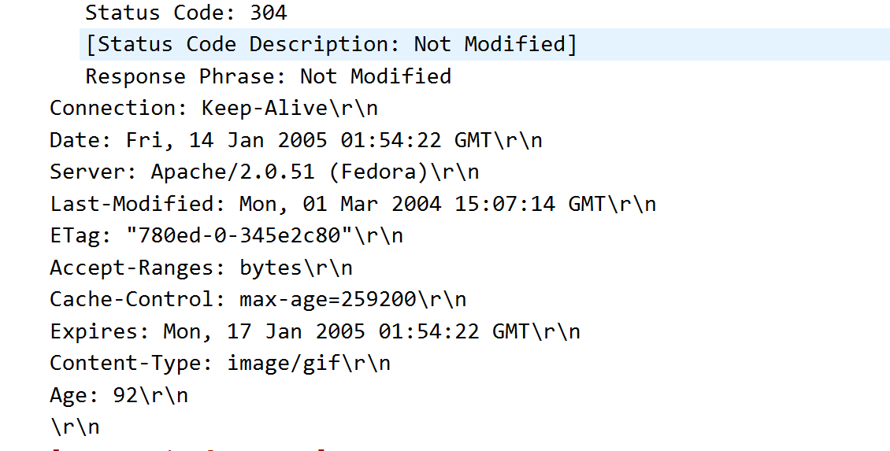
*Server responds with HTTP 304 Not Modified despite no prior 200 OK exchange appearing in the capture; content-type `image/gif` is a flagged indicator possibly used for C2 beaconing.*

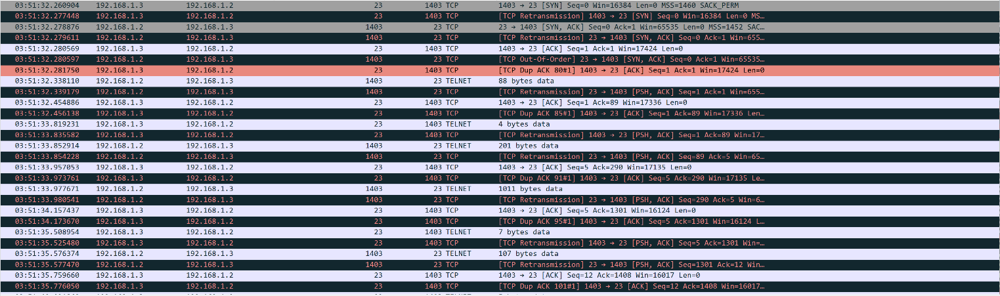
*Successful TCP 3-way handshake (SYN, SYN-ACK, ACK) establishing the Telnet session on port 23 between the two internal hosts.*

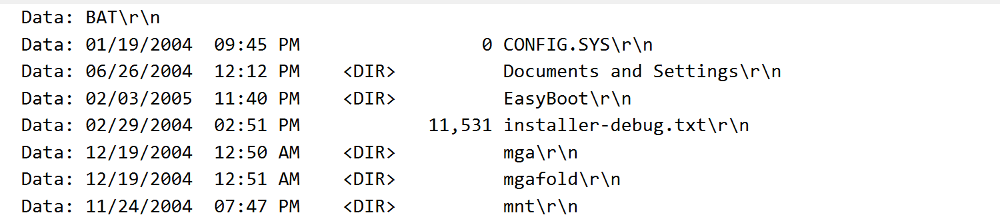
*Attacker runs `dir /r /n` over the Telnet session to enumerate NTFS Alternate Data Streams — a technique used to check for hidden payloads attached to files.*

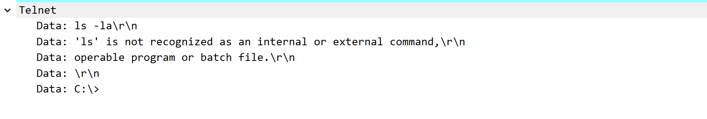
*Attacker issues a Linux-style command while connected to the Windows host over Telnet, suggesting a Linux-based attacking machine.*

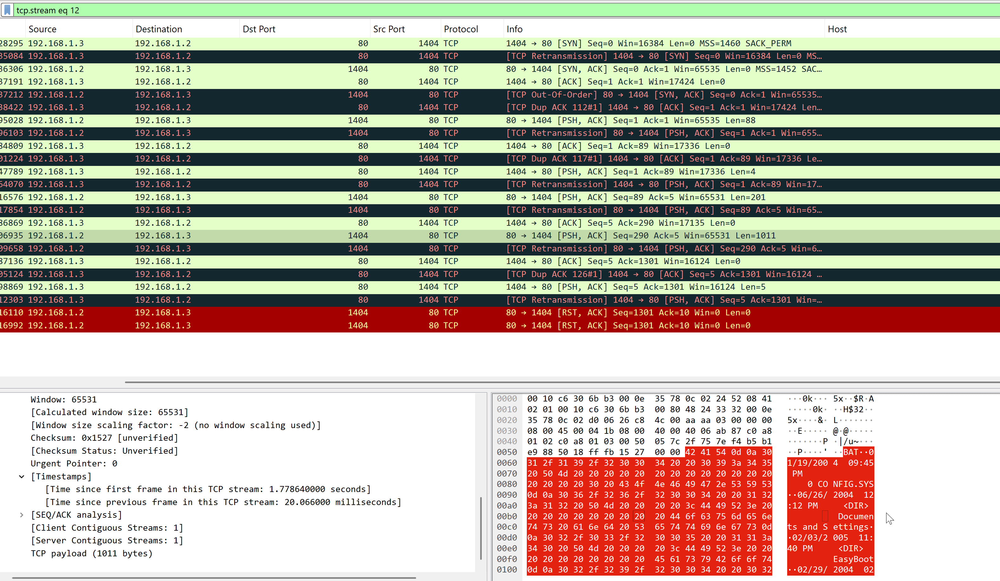
*Attacker shifts from Telnet to relaying shell command output (the `dir` results) over HTTP port 80 — a less-monitored channel than Telnet's port 23, used to blend in with normal web traffic.*
