# Alert Simulation & EDR Detection — Microsoft Defender for Business

## Summary
End-to-end validation of an EDR detection pipeline in Microsoft Defender for Business: endpoint onboarding through Intune, policy application, and controlled attack simulation on a real Entra-joined Windows 11 device. Two simulations were run — a signature-based EICAR test and a Microsoft-provided PowerShell behavioral detection script — to confirm both antivirus and behavioral/incident-correlation layers function correctly.

**Environment:** Entra-joined Windows 11 client, Intune-managed, onboarded to Defender for Business
**Tools:** Microsoft Defender for Business, Intune, PowerShell

## MITRE ATT&CK Mapping

| Technique ID | Name | Context |
|---|---|---|
| T1204.001 | Malicious Link | EICAR download vector |
| T1059.001 | PowerShell | Execution |
| T1053.002 | At (Scheduled Task) | Persistence |
| T1053 | Scheduled Task/Job | Persistence |
| T1106 | Native API | Execution / process enumeration |
| T1057 | Process Discovery | Discovery |

## Simulation 1 — EICAR (Signature-Based Detection)

Downloaded the EICAR test file to confirm antivirus signature detection end-to-end.

- Alert: `EICAR_Test_File malware was prevented`
- Detection source: Antivirus
- First activity → Alert generated: **~3 minutes**
- EICAR is not a real executable (`Is PE: False`) — it's a text string mimicking a malware signature. Defender flagged it on signature match, not execution behavior, confirming the AV engine correctly identifies known-bad patterns without needing behavioral triggers.

## Simulation 2 — PowerShell Behavioral Detection

Ran a Microsoft-provided PowerShell script that bypasses execution policy, runs hidden, attempts to download and execute a file, then creates a scheduled task for persistence.

**Result:** A multi-stage incident was created correlating 3 alerts, with 5 MITRE tactics/techniques identified.

**Process chain observed:** `userinit.exe/explorer.exe` (baseline) → `cmd.exe` (elevated, high integrity) → `powershell.exe` (elevated, high integrity) → `at.exe`

### Key Finding
`at.exe` (PID 1564) was the most significant indicator in the chain — it's a legacy Windows task-scheduling utility, and its invocation here represents a **persistence mechanism** (T1053.002) that would survive a reboot. This was prioritized over the other flagged behaviors (process enumeration via Native API calls, T1106) because persistence is what turns a one-time compromise into a standing foothold.

The script's download target was `127.0.0.1` (localhost) — no real payload was ever retrieved. This confirms Defender's detection fired purely on **behavioral signals** (execution policy bypass, hidden window, scheduled task creation), not on catching a malicious payload in transit. That distinction matters: it shows the behavioral engine works independently of signature or payload inspection.

## Detection & Mitigation Recommendations

- **Primary mitigation:** Block `at.exe` execution via AppLocker or WDAC — this directly closes the persistence vector observed.
- Restrict scheduled task creation to admin accounts only via GPO.
- Disable the Task Scheduler service on endpoints where it has no legitimate business use.
- Given the ~3 minute detection-to-alert gap on the signature-based test, consider this as a baseline for tuning alert latency expectations on behavioral detections, which typically take longer.

## Conclusion
Both simulations confirmed the full detection pipeline — onboarding, policy enforcement, alert generation, and incident correlation — functions correctly. The PowerShell simulation in particular demonstrated Defender's ability to perform multi-stage behavioral analysis and MITRE-mapped incident correlation beyond simple signature matching.

## Evidence

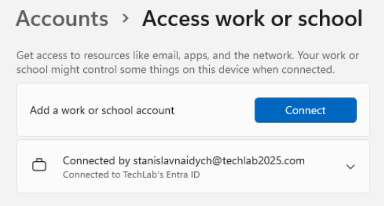
*Windows 11 client confirmed as Entra-joined, satisfying the first onboarding prerequisite.*

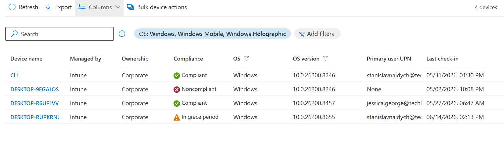
*Device DESKTOP-RUPKRNJ visible and enrolled in both Microsoft Intune and Defender for Business.*

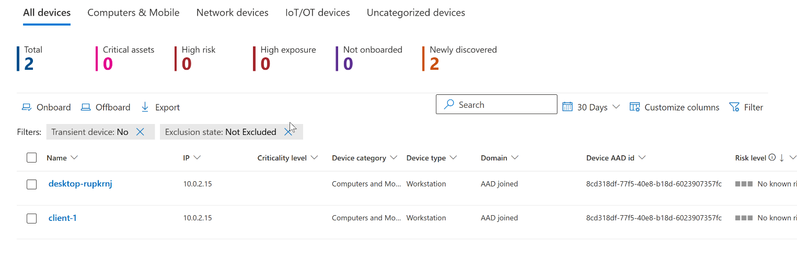
*Confirmation that the Default EDR policy and Windows Defender Antivirus policy are successfully applied to the device.*

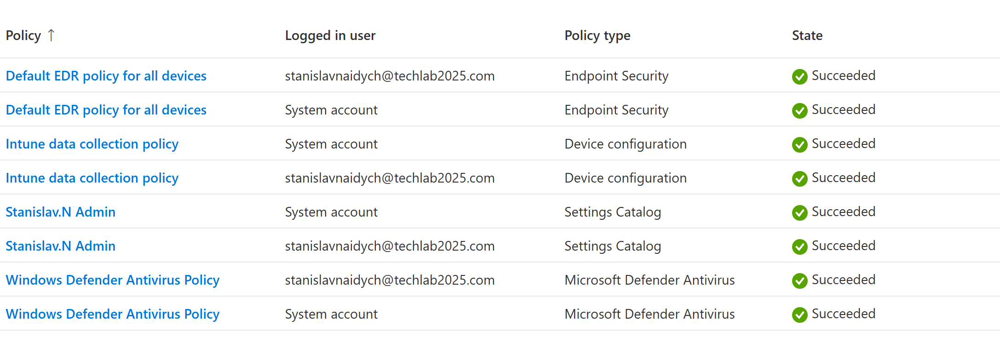
*Device visibility confirmed in the Defender portal prior to running either simulation — final prerequisite check.*

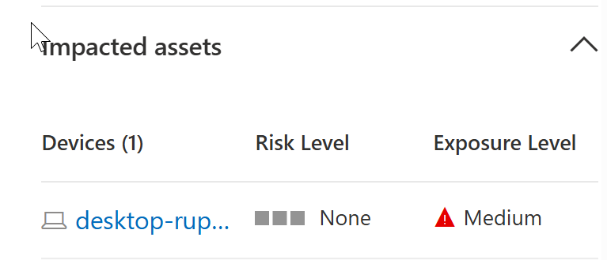
*Alert card for the EICAR detection: signature-based, detection source Antivirus, risk level None, exposure level Medium.*

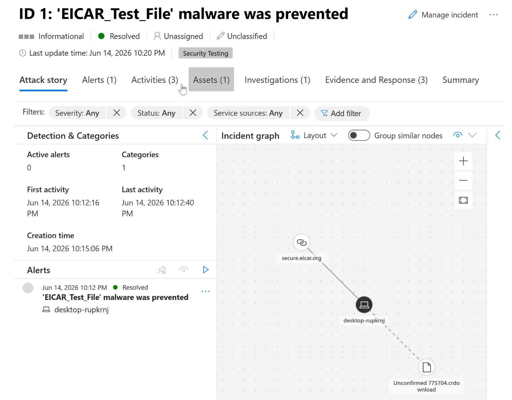
*Defender's visualized attack story for the EICAR file download and prevention event.*

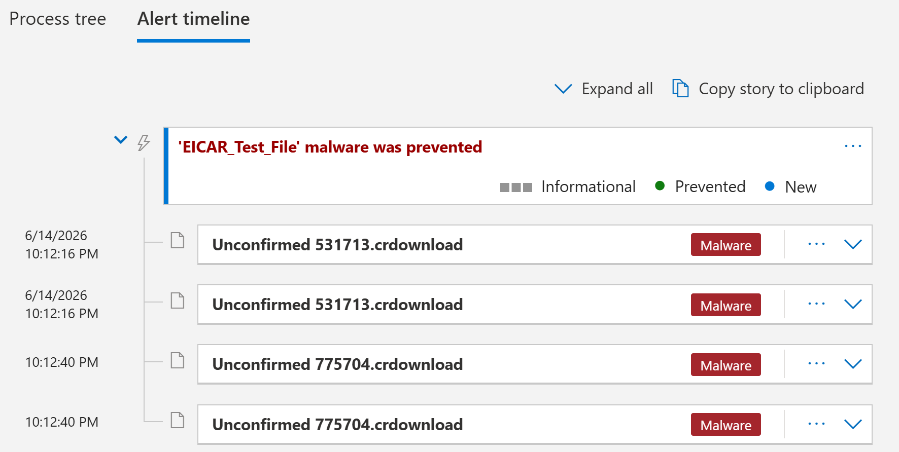
*Timeline showing first activity at 10:12:16 PM and alert generation at 10:15:05 PM — roughly a 3-minute detection-to-alert gap.*

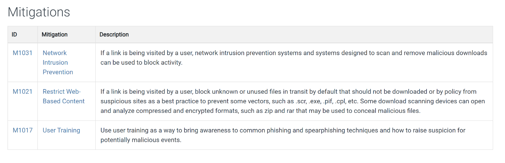
*Defender's recommended mitigation actions following the EICAR detection.*

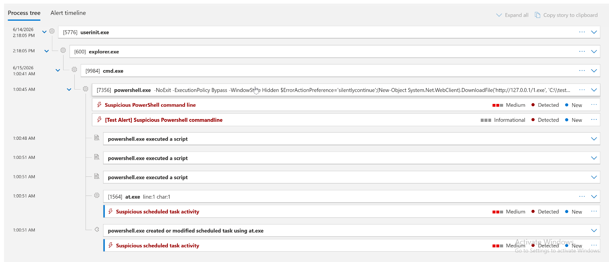
*Process chain from the PowerShell simulation: userinit.exe/explorer.exe (baseline) → cmd.exe (elevated) → powershell.exe (elevated) → at.exe (persistence indicator).*

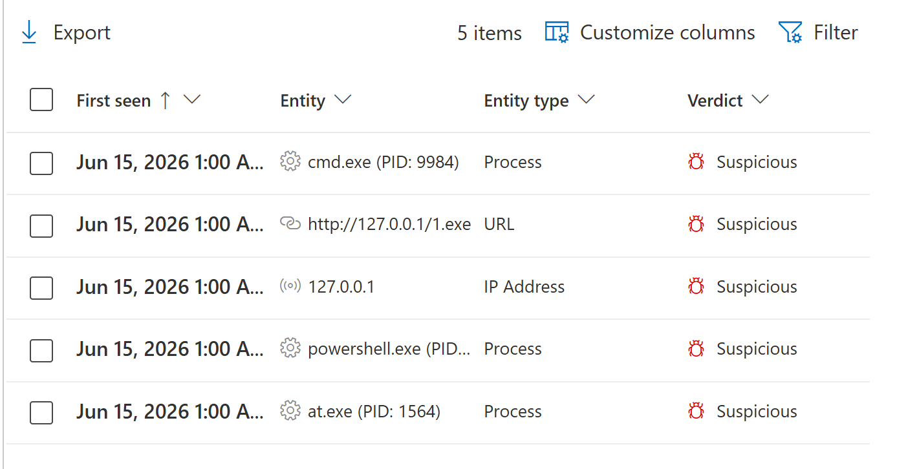
*EDR-flagged technique detail: T1106 (Native API — process enumeration via Process32First/Next, Thread32First/Next, CreateToolhelp32Snapshot) and T1057 (Process Discovery).*

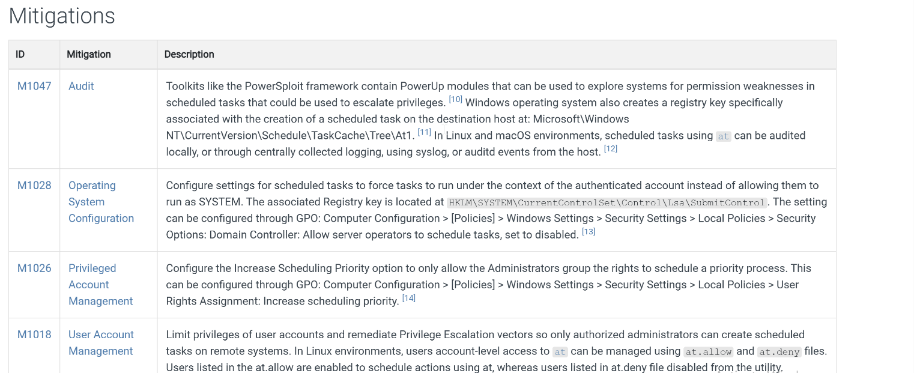
*Recommended mitigation actions for the multi-stage PowerShell/persistence incident, informing the AppLocker/WDAC and scheduled-task restriction recommendations above.*
