# Azure Arc + Azure Monitor Agent: Lockout Detection Lab

## Part-1: Onboarding Windows Server to Azure Arc & Installing Azure Monitor Agent

**Date:** June 4, 2026

**Environment:** Azure VM (dc-1) \| Windows Server 2025 \| Azure-Lab
Resource Group

## Step 1 — Verify Arc Connectivity

Confirmed dc-1 appeared in Azure Arc with the following details:

- Status: Connected

- OS: Windows Server 2025 Standard Evaluation

- FQDN: dc-1.techlab2025.com

- Location: East US

- Resource Group: Azure-Lab

- Arc Agent Version: 1.64.03414.2961

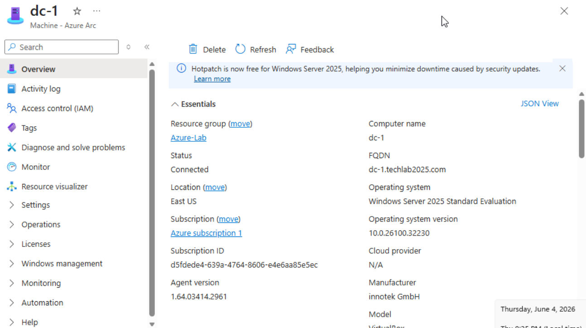

## Step 2 — Prepare PowerShell on dc-1

### 2.1 Install the Az Module

Run the following command to install the Az PowerShell module:

Install-Module -Name Az -AllowClobber -Scope CurrentUser -Force

**Note:** Accept any NuGet or untrusted repository prompts with Y.

### 2.2 Import the Az Module

Import-Module Az

**Note:** Unapproved verb warnings may appear during import — these are
expected and can be ignored.

### 2.3 Connect to Azure

Connect-AzAccount

**Note:** A browser window will open — sign in with your Azure account
credentials.

### 2.4 Set Subscription Context

Set-AzContext -SubscriptionId "\<your-subscription-id\>"

## Step 3 — Install Azure Monitor Agent via Arc Extension

Run the following command to deploy the Azure Monitor Agent onto dc-1
through Azure Arc:

New-AzConnectedMachineExtension -Name "AzureMonitorWindowsAgent"
-ResourceGroupName "Azure-Lab" -MachineName "dc-1" -Location "eastus"
-Publisher "Microsoft.Azure.Monitor" -ExtensionType
"AzureMonitorWindowsAgent"

**Note:** This deploys the AMA extension through Azure Arc onto dc-1.
The extension is the delivery mechanism — AzureMonitorWindowsAgent is
the actual agent being installed.

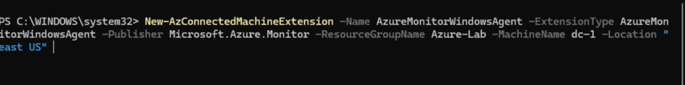

### 

### Verify Installation

Get-AzConnectedMachineExtension -ResourceGroupName "Azure-Lab"
-MachineName "dc-1"

Expected output: **ProvisioningState: Succeeded**

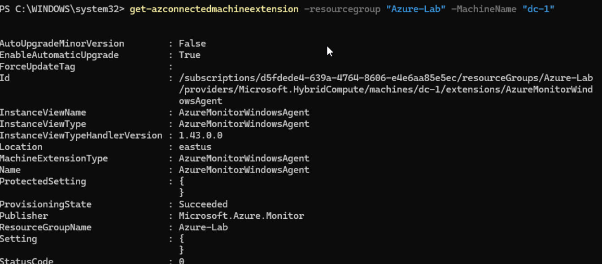

## Part-2 Log Analytics workspace & Security Audit Policy Configuration

Step-1 - Create Log Analytics Workspace

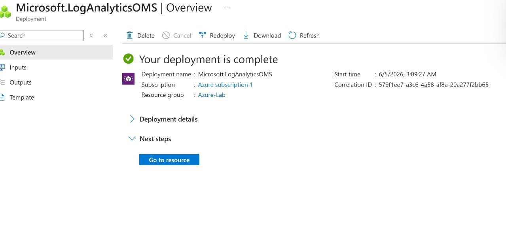

Log Analytics Workspace:

Central storage and analysis engine for all logs collected by Azure
Monitor.

**Log Ingestion** — Receives logs from Arc machines via the AMA agent
and DCR. Data is stored in structured tables such as SecurityEvent,
Event, and Syslog.

**Analysis** — Query logs using KQL (Kusto Query Language). Example:
SecurityEvent \| where EventID == 4625 returns all failed logins.

**Functions** — Supports saved queries, alert rules, workbooks, and
configurable log retention (default 30 days).

## Step 2 – Configure Data Collection Rule (DCR)

Created a DCR via Azure Portal with the following configuration:

Rule Name: Security Event Log

Subscription: Azure subscription 1

Resource Group: Server-lab

Region: Central India

Platform Type: All (Windows and Linux)

Data Collection Endpoint: None

Data Sources configured:

Windows Event Logs → Azure Monitor Logs

Linux Syslog → Azure Monitor Logs

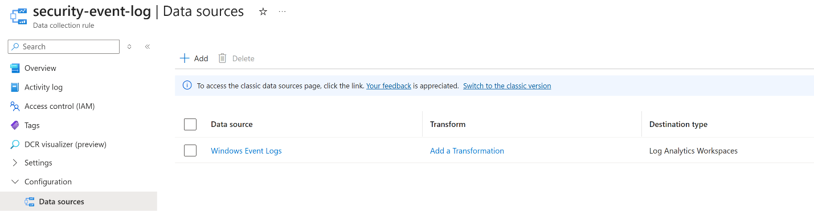

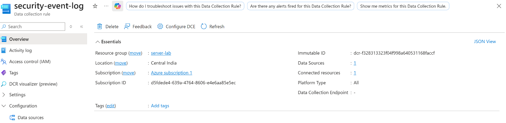

Data Collection Rules are configurations that define how telemetry and
log data are collected and routed to destinations like Log Analytics
workspaces, Azure Storage, or Event Hubs.

## 

## 

## 

## 

## 

## 

## Step 3 – Configure Audit Policies on Windows Server 2025

## 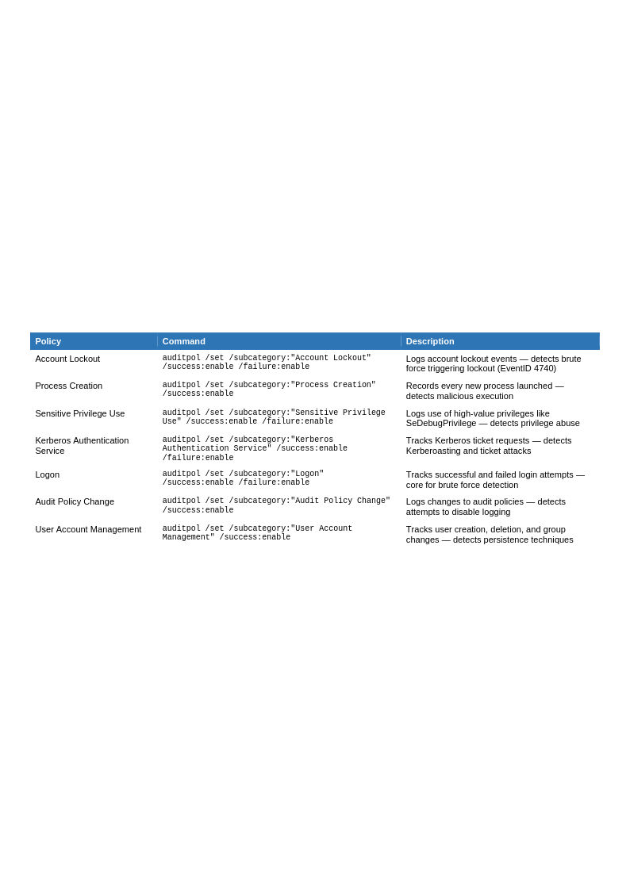

## 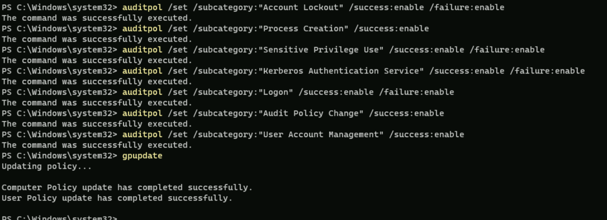

Configured local domain-wide account lockout policy via PowerShell

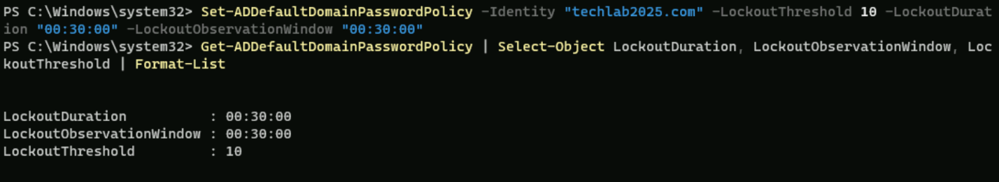

The account lockout policy will lock the user’s account when they
experience failed login 10 times.

Configured Fine-Grained-Password-Policy to protect Privileged Accounts:

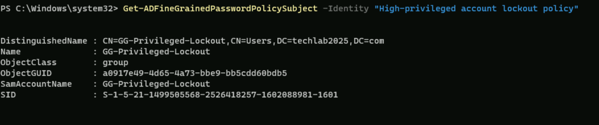

FGPP is used to enhance security for specific groups or users, enforcing
certain password criteria to mitigate password abuse.

**Note:** FGPP can’t be applied to universal groups including: Domain
Admins and Enterprise Admins

## Part-3: Generate and Analyze Security Events via KQL

Step 3.1: Generated multiple failed logins using a PowerShell script via
NTLM

## 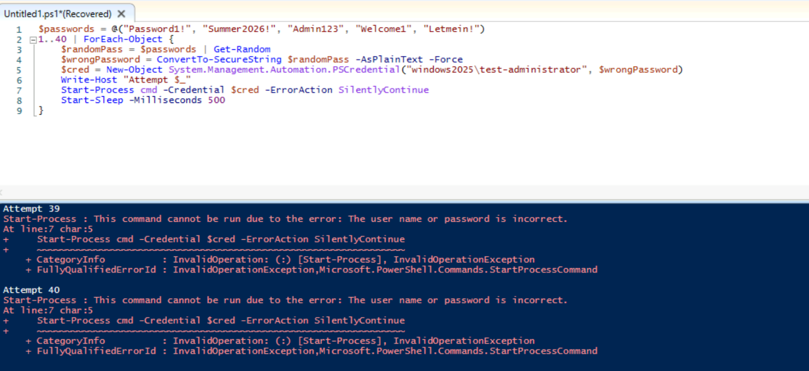

1.  This script uses NTLM authentication (Authentication Package:
    NtlmSsp) via the Secondary Logon service.

2.  **Admin Safeguards**: To prevent Denial of Service (DoS) attacks on
    high-privilege accounts (*Enterprise Admins*), Active Directory
    purposely **ignores rapid NTLM failures** and refuses to increment
    the domain-wide bad password counter (badPwdCount).

3.  **Local Caching**: The operating system cached the first password
    failure locally, dropping the remaining 39 attempts before they
    could ever hit the Active Directory database.

As a result, despite enforced FGPP, after running the script, the bad
count responsible for an account lockout was zero.

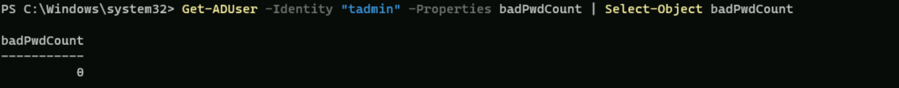

Step 3.2: Generated a PowerShell script via LDAP Authentication

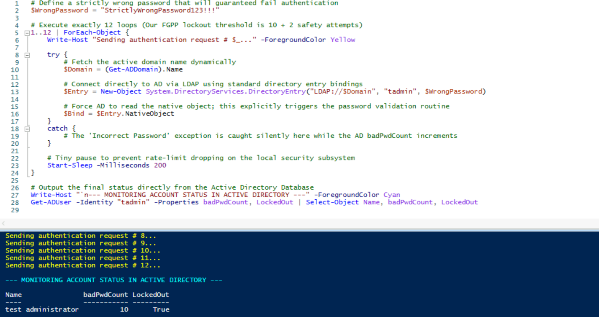

 **Direct LDAP Bind**: The NativeObject script bypasses local Windows
wrappers entirely and hits the Active Directory service directly using
**Kerberos**.

 Forced Evaluation: Active Directory cannot silently cache or ignore
direct LDAP authentication transactions; it was architecturally forced
to record all bad attempts, causing the account to lock out instantly
once the threshold of 10 was reached.

Step 3.3 – Querying Security Event IDs via KQL

After running 2 scripts to simulate a brute-force attack, KQL querying
is used to uncover security Event IDs related to the attack.

Failed login (4625): An account failed to log on

Multiple failed logins confirm the method used for authentication –
Package Name (NTLM only) – legacy authentication method protected by
LSASS (Local Security Authority Subsystem Service)

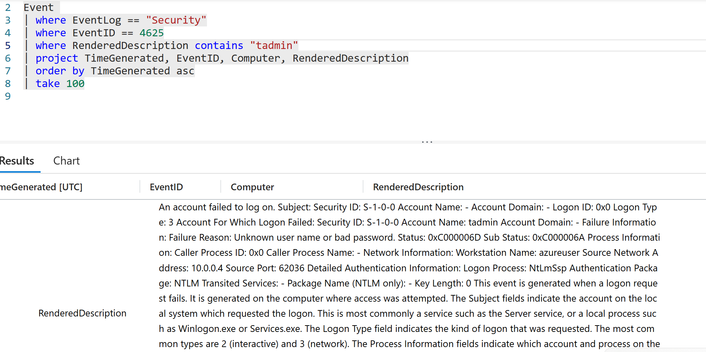

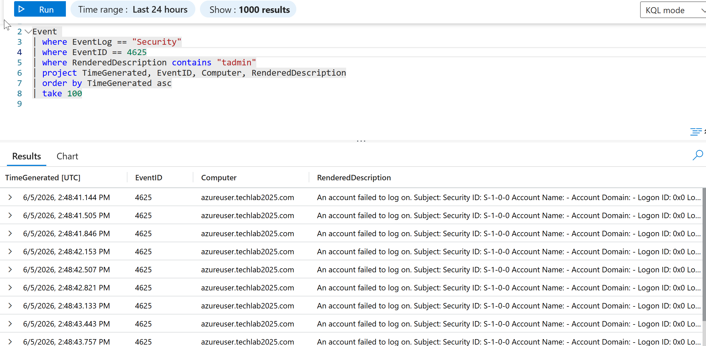

Event ID (4776): The domain controller attempted to validate the
credentials for an account

This event ID typically precedes account lockout

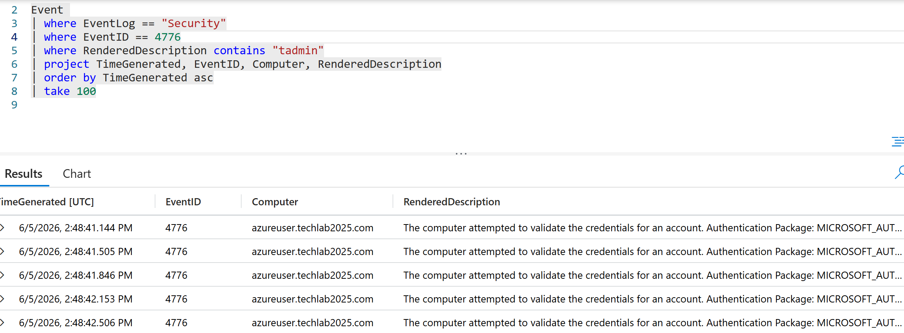

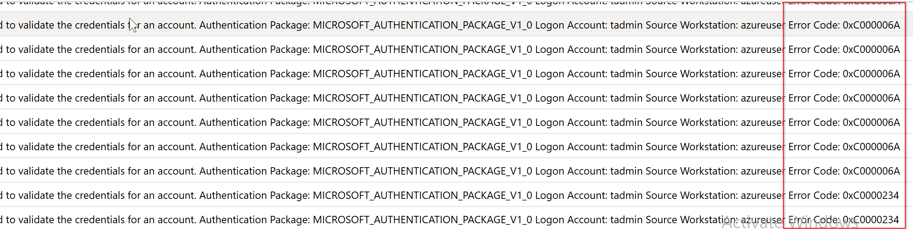

- 0xC000006A: Incorrect password (a valid username was entered, but the
  password was wrong

- 0xC0000234: The account is currently locked out.

Account Lockout (4740)

Event ID 4740 is generated every time a user account is locked out

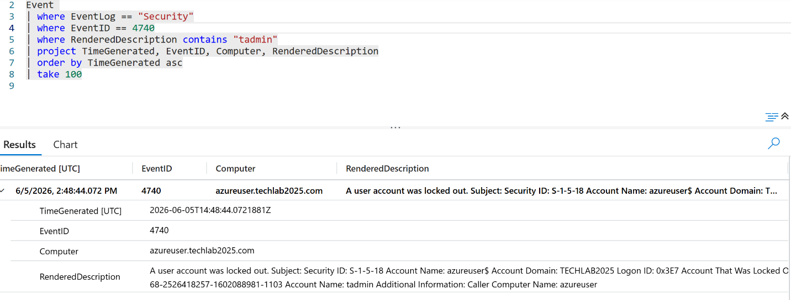

Authentication chain triggering lockout

\[Client attempt\]

↓

LSASS (local filtering, caching, throttling)

↓

OR

Direct DC authentication (LDAP / Kerberos / NTLM validation)

↓

\[Domain Controller updates badPwdCount\]

↓

\[FGPP / Lockout policy triggers\]

Lessons learned:

- **Detection Engineering Takeaways**

- This lab is a live simulated credential attack (MITRE ATT&CK T1110 -
  Brute Force).

- The NTLM test proved a real detection blind spot: AD silently dropped
  39 of 40 failed attempts and never incremented badPwdCount, so an
  attacker using NTLM could avoid triggering 4740 entirely.

- Lesson: never rely on 4740 (lockout) alone as a brute-force detector -
  alert on the upstream 4625/4776 volume, since lockout can be silently
  bypassed depending on auth protocol.

- **Brute Force Detection Patterns (IOCs)**

- High volume of 4625 events for one account or one source IP within a
  short window (e.g. 10+ in 5 minutes).

- 4776 failures with sub-status 0xC000006A (bad password) clustering
  rapidly - precedes lockout.

- Repeated 0xC0000234 (account already locked) - signals continued
  automated attempts against a locked account.

- Package Name = NTLM on a domain-joined host talking to a DC is mildly
  anomalous by itself, since Kerberos is the expected protocol.

- Pattern shape importance: one source vs one account (classic brute
  force) vs one source vs many accounts (password spray) vs one account
  from many sources (distributed brute force).

- Off-hours timing or a source host/IP that has never authenticated as
  that account before.

**Suggested follow-up KQL queries for this scenario** (not executed
against this lab's workspace — drafted here, no screenshot evidence to
back them):

```kql
// High-volume failed logons per account, 5-minute buckets
SecurityEvent
| where EventID == 4625
| summarize FailCount = count() by TargetAccount, bin(TimeGenerated, 5m)
| where FailCount >= 10
```

```kql
// Spray pattern: one source hitting many distinct accounts
SecurityEvent
| where EventID == 4625
| summarize DistinctAccounts = dcount(TargetAccount) by IpAddress, bin(TimeGenerated, 15m)
| where DistinctAccounts >= 5
```

```kql
// Correlate 4776 failures to the 4740 lockout they caused
SecurityEvent
| where EventID in (4776, 4740)
| summarize Events = make_list(EventID), Times = make_list(TimeGenerated) by TargetUserName
| where array_length(Events) > 1
```

- **Conclusion**

> Environment lifecycle is itself a SOC-relevant lesson: this
> lab's Arc-onboarded VM and Log Analytics workspace no longer exist
> after the Azure license lapsed, so the findings above (Steps 3.1-3.3)
> are what was actually captured while the environment was live — the
> queries above are follow-up suggestions only, not run or verified in
> this environment.

