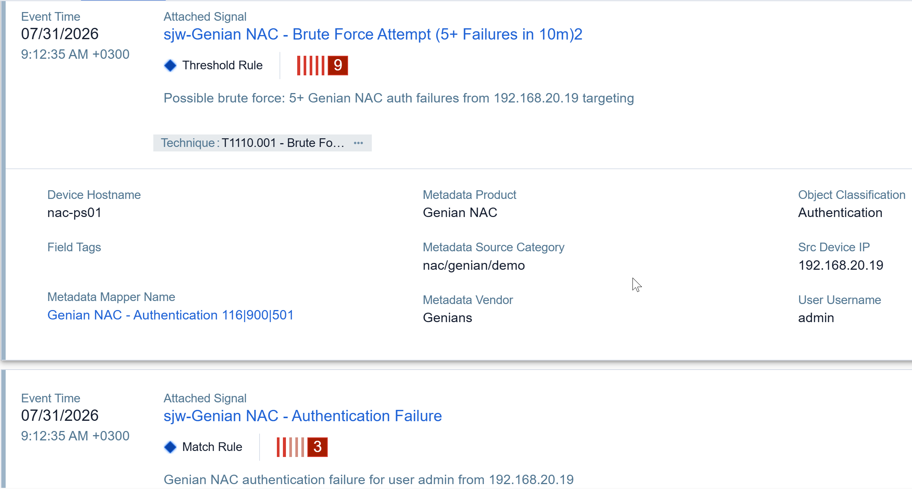
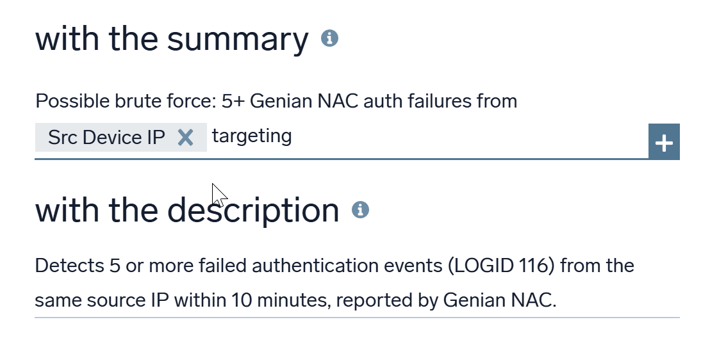
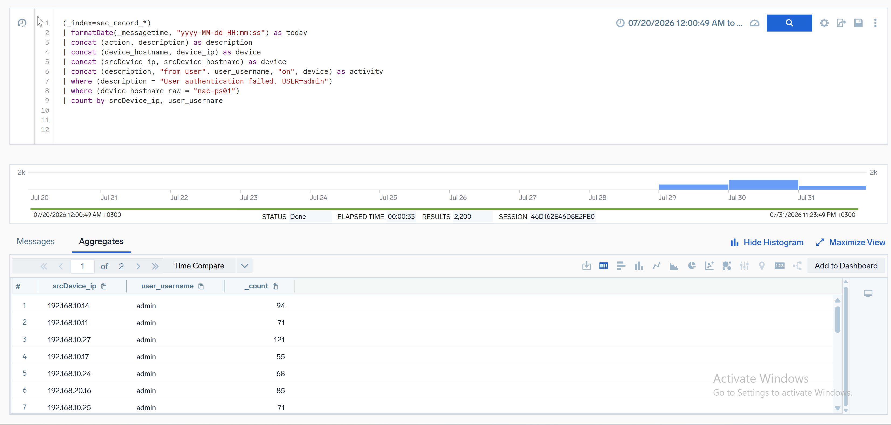
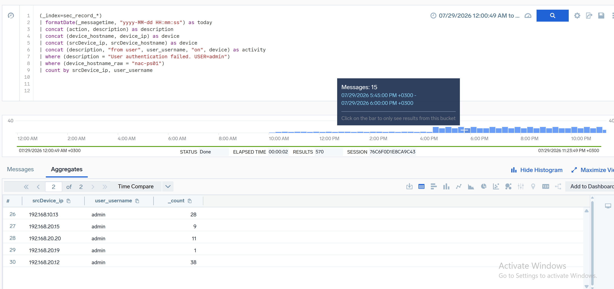
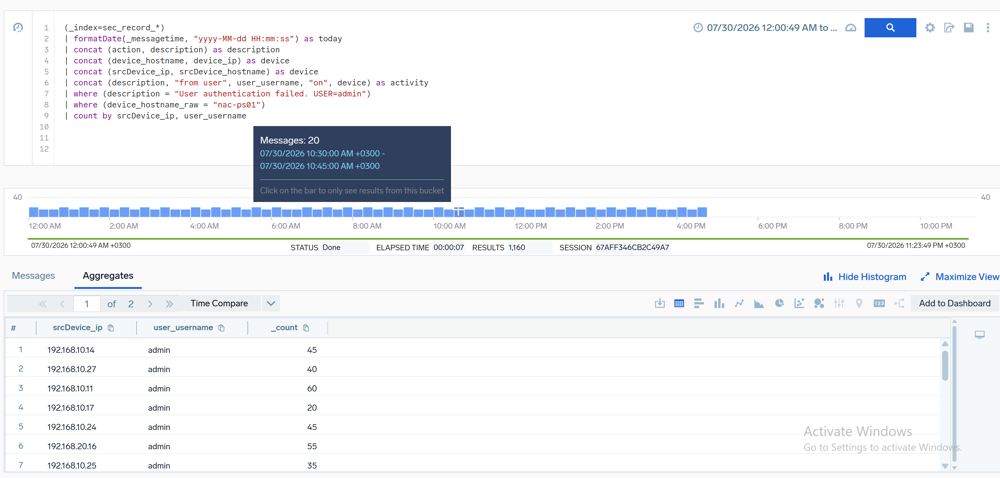
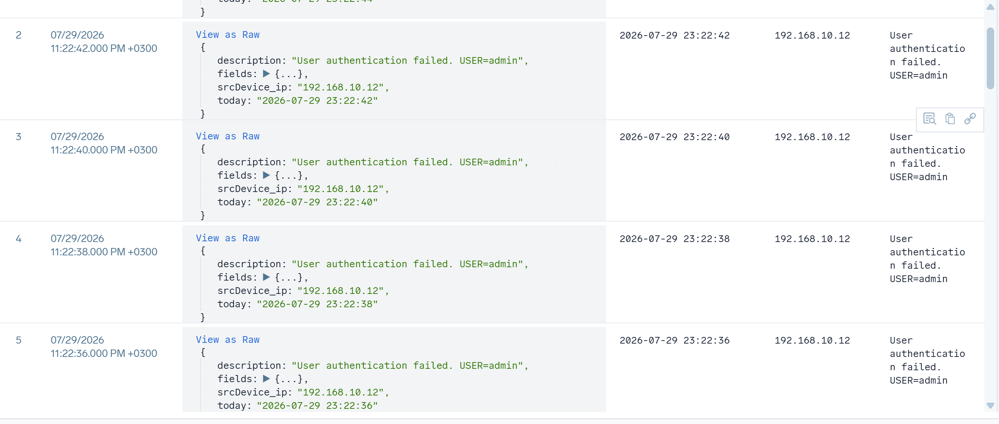
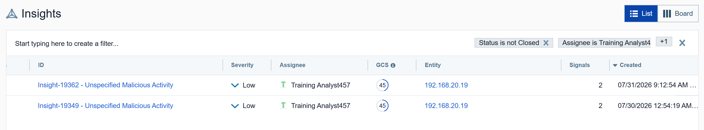

# Insight Investigation: Brute Force Attempt — Account "admin" on nac-ps01

**Platform:** Sumo Logic Cloud SIEM
**Insight ID:** Insight-19362 — Unspecified Malicious Activity
**Date Detected:** 2026-07-31 09:12:35 AM (+0300)
**Status:** Closed
**Affected Systems/Accounts:** `nac-ps01` (10.0.4.250), `admin`
**MITRE ATT&CK Technique:** [T1110.001 - Brute Force: Password Guessing](https://attack.mitre.org/techniques/T1110/001/)

---

## Alert Summary

Sumo Logic Cloud SIEM generated Insight-19362 after correlating two signals against the `nac-ps01` Genian NAC appliance:

| Signal | Rule Type | Description |
|---|---|---|
| sjw-Genian NAC - Authentication Failure | Match Rule | Genian NAC authentication failure for user `admin` from `192.168.20.19` |
| sjw-Genian NAC - Brute Force Attempt (5+ Failures in 10m) | Threshold Rule | Detects 5+ failed authentication events (LOGID 116) from the same source IP within 10 minutes, reported by Genian NAC |

**Insight flagged:** 5 consecutive failed login attempts for user `admin` within a 10-minute window on 2026-07-31, originating from `192.168.20.19`.



The underlying detection rule's summary and description confirm the per-source-IP, 10-minute threshold logic:



---

## Timeline Analysis

An extended log review (beyond the insight's default lookback window) was performed to establish the full scope of activity against the `admin` account on `nac-ps01`.

- **2,200 failed login attempts** against `admin` identified, beginning **2026-07-29** — two days before the insight's trigger date — and continuing through **2026-07-31**.
- Attempts originated from **30+ distinct source IPs** across the `192.168.10.0/24` and `192.168.20.0/24` ranges.
- Most individual source IPs generated exactly 5 failed attempts each and **did not trigger an alert**, because the brute-force threshold rule had not yet been implemented on 2026-07-29–30.
- The threshold rule (once live on 2026-07-31) monitored failed logins per source IP within a 10-minute window, generating a brute-force signal only when a single IP exceeded the threshold — which is what finally fired on 07/31.

**Query used for historical correlation** (Sumo Logic search):

```
_index=sec_record_*
| formatDate(_messagetime, "yyyy-MM-dd HH:mm:ss") as today
| concat(action, description) as description
| concat(device_hostname, device_ip) as device
| concat(srcDevice_ip, srcDevice_hostname) as device
| concat(description, "from user", user_username, "on", device) as activity
| where description = "User authentication failed. USER=admin"
| where device_hostname_raw = "nac-ps01"
| count by srcDevice_ip, user_username
```



---

## Historical Event Correlation

- Failed logins on **2026-07-29 and 2026-07-30** show an **identical ~15-minute time pattern**, suggesting scripted/automated attempts rather than organic user error.
- Because the detection rule was not implemented until 2026-07-31, the 07/29–30 activity was **not detected at the time** it occurred — a detection gap.

| Jul 29 pattern | Jul 30 pattern |
|---|---|
|  |  |

Raw event review confirms the repeated failed-authentication messages from a single rotating IP within each burst:



- `192.168.20.19` (the source IP that ultimately tripped the 07/31 alert) is also linked to a **separate prior insight**: Insight-19349 — Unspecified Malicious Activity (2026-07-30), containing identical Authentication Failure and Brute Force signals. This indicates the source had targeted the environment before, rather than acting as a one-time occurrence.



- The observed source subnets were associated **exclusively** with authentication attempts targeting `nac-ps01` — no other systems were touched.
- **No successful authentication events** ("Administrator login successful," "User authentication successful") for the `admin` account were identified between 2026-07-29 and 2026-07-31.
- Source IPs from both subnets could **not** be resolved to associated hostnames.

---

## Assessment

The distributed, rotating-IP pattern — ~30 unique source IPs each generating exactly 5 failed attempts, spread across two internal /24 subnets, on an identical time cadence over three days — is atypical of normal failed-login behavior (e.g., a user mistyping a password).

**This is consistent with a distributed brute-force campaign designed to evade per-source-IP detection thresholds by rotating source addresses**, staying just under the 5-in-10-minute threshold on each individual IP until the rule change on 07/31 caused a single IP to cross the line and generate the alert.

Because no successful authentications occurred, the `admin` account does not appear to have been compromised. However, the multi-day, pre-alert nature of the activity indicates the environment was under sustained credential-guessing pressure that the original detection logic missed.

---

## Remediation

- [ ] Terminate all active sessions for the `admin` account
- [ ] Reset the `admin` account password
- [ ] Notify the account owner of the failed login activity observed 2026-07-29–07-31
- [ ] Investigate DHCP lease records for the ~30 source IPs across `192.168.10.0/24` and `192.168.20.0/24` to determine whether the addresses were assigned by the legitimate DHCP server, a compromised DHCP service, or a rogue/unauthorized DHCP server

---

## Detection Improvement Recommendations

1. **Tune the existing rule to correlate failed logins across IP ranges associated with a targeted entity/account**, rather than evaluating each source IP in isolation — this closes the gap that let ~30 IPs each stay under the per-IP threshold.
2. **Introduce a companion rule that thresholds failed logins per targeted user account, independent of source IP**, specifically to catch distributed / rotating-IP brute-force campaigns like this one.

---

## Key Takeaway

A threshold rule scoped to a single dimension (source IP) is trivially evaded by spreading the same volume of attempts across many IPs. This investigation highlights the value of extending lookback windows during triage — the insight's original 10-minute window captured only the tail end of a 3-day, 2,200-attempt campaign — and of building detections that correlate on the *target* (account/asset) as well as the *source*.
